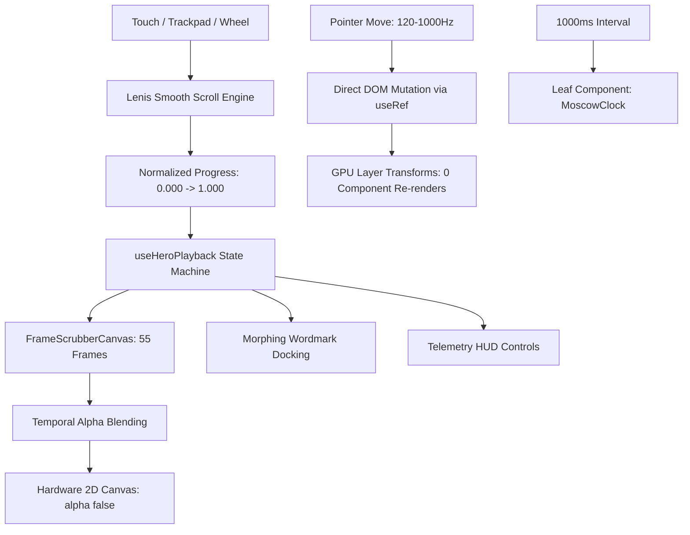

<div align="center">

# 🏛️ YEGOR.DEV // PORTFOLIO

### Creative Frontend Engineering & Interactive Web Showcase

[](https://yegor-dev.vercel.app/)
[](https://nextjs.org/)
[](https://react.dev/)
[](https://www.typescriptlang.org/)
[](https://tailwindcss.com/)

<p align="center">
  Interactive personal portfolio engineered with GPU-accelerated Canvas frame scrubbing, direct DOM pointer manipulation, isolated component rendering, and fluid scrollytelling physics.
</p>

[Explore Live Demo ↗](https://yegor-dev.vercel.app/) · [Architecture Specs](./ARCHITECTURE_AND_DESIGN_SYSTEM.md) · [Best Practices Playbook](./BEST_PRACTICES_PLAYBOOK.md)

</div>

---

## 🎯 Overview & Purpose

This repository is a showcase of creative frontend and product engineering. Rather than building a conventional static portfolio, the goal was to craft a cinematic, story-driven web experience—combining interactive canvas graphics, fluid inertia scroll, and telemetry HUD controls—while maintaining clean component architecture, strict typing, and high runtime performance.

---

## 💡 Key Engineering Decisions

### 1. HTML5 Canvas Frame Scrubber vs `<video>`
* **The Challenge:** The Hero section requires deterministic, bidirectional scrubbing of a 55-frame Da Vinci technical drawing sequence synchronized to user interaction and scroll progress.
* **Why `<video>` Fails Here:** Native HTML5 video elements rely on codec-dependent keyframe decoding. Rapidly seeking `currentTime` on scroll causes frame-dropping, perceptible decode latency, and inconsistent playback behavior across mobile browsers.
* **Our Solution (`FrameScrubberCanvas.tsx`):**
  - Uses an HTML5 2D `<canvas>` with `alpha: false` to allow the GPU to bypass compositing blend calculations.
  - **Temporal Crossfade:** For fractional progress steps (e.g. frame `24.4`), the canvas blends adjacent frames with dynamic alpha weighting, creating continuous motion picture fluidity.
  - **Progressive Asset Pipeline:** The initial frame (Frame 1) loads eagerly to guarantee fast initial render. The remaining frames are streamed in small batches during idle browser periods using native `requestIdleCallback`.

### 2. Direct DOM Mutations for High-Frequency Pointer Interactions
* **The Problem:** Cursor spotlight effects (`CurtainFooter.tsx`, `ContactCardItem.tsx`) follow mouse movements that fire at 120–1,000 Hz on modern high-refresh screens and gaming mice.
* **Why React State Fails:** Updating `useState(x, y)` on every mouse coordinate floods the main thread, triggering re-render cascades, virtual DOM diffing, and garbage collection pressure.
* **Our Solution:** Coordinates bypass React state entirely. Mutable `useRef<HTMLDivElement>` references apply inline styles directly with hardware-composited `radial-gradient` and `translate3d`, achieving 0 React component re-renders during mouse tracking.

### 3. Leaf-Node State Isolation for Live Clock
* **The Problem:** Placing a live ticking clock (`HH:MM:SS`) in a global layout or header naively forces the whole layout to re-render every second.
* **Our Solution (`MoscowClock.tsx`, `useMoscowClock.ts`):**
  - Ticking seconds are strictly encapsulated in an isolated leaf component `<MoscowClock />`. Parent containers (`Header`, `NavigationDrawer`, `CurtainFooter`) are wrapped in `React.memo` and experience zero re-renders.
  - Time formatting uses a module-level `Intl.DateTimeFormat` singleton to eliminate repetitive V8 ICU engine allocations on every tick.

### 4. Type-Safe Polymorphic Primitives
* **The Pattern (`Button.tsx`, `GlassCard.tsx`):**
  - UI components support the polymorphic `as` prop (`as="a"`, `as="button"`, `as={Link}`) with full TypeScript type safety and autocompletion.
  - Attribute collisions between custom props and native tags are eliminated using `Omit<ComponentPropsWithoutRef<E>, keyof BaseProps | 'as'>`.
  - Built-in defense defaults: links with `target="_blank"` automatically enforce `rel="noopener noreferrer"`, and buttons default to `type="button"` to avoid accidental form submissions.

---

## 🗺️ System Architecture



---

## 💼 Featured Projects

* **NoLogs Privacy SaaS**: High-velocity privacy infrastructure, automated subscription billing pipelines (FastAPI & PostgreSQL), and secure server tunnel topology.
* **Radiotochka**: Digital platform and CMS for a creative advertising agency featuring mathematical fluid typography and interactive showcases.
* **The 50th Jubilee**: Bespoke interactive event web app with luxury aesthetics, RSVP guest registration, and native cross-platform calendar synchronization (`.ics`, Google Calendar, Apple Calendar).

---

## 🛠️ Tech Stack & Dependencies

| Layer | Technologies |
|---|---|
| **Core Framework** | Next.js 15.2 (App Router), React 19, TypeScript 5.8 |
| **Styling & Design** | Tailwind CSS v4, Vanilla CSS Custom Properties |
| **Motion & Scroll** | Lenis Scroll, HTML5 2D Canvas, Native RAF Loops |
| **Asset Pipeline** | Progressive batch loading (`requestIdleCallback`) |
| **Deployment** | Vercel Global Edge Network |

---

## 🚀 Running Locally

```bash
# 1. Clone the repository
git clone https://github.com/heayr/my_portfolio_web.git

# 2. Enter directory
cd my_portfolio_web

# 3. Install dependencies
npm install

# 4. Start development server
npm run dev
```

Open [http://localhost:3000](http://localhost:3000) in your browser.

---

<details>
<summary><h2>🇷🇺 Краткая русская версия</h2></summary>

### О проекте
Интерактивный персональный сайт-портфолио и витрина креативного фронтенд-инжиниринга. Проект демонстрирует покадровую анимацию на HTML5 Canvas, плавную физику скролла Lenis, морфинг интерфейсных элементов и строгую архитектуру компонентов на Next.js 15, React 19 и TypeScript.

### Ключевые инженерные решения
1. **Canvas вместо `<video>`**: покадровый скраббинг 55 изображений через 2D Canvas обеспечивает мгновенный детерминированный доступ к кадрам без задержек декодирования видеопотока. Дробный скролл сглаживается темпоральным альфа-блендингом смежных кадров.
2. **Прямые DOM-мутации для курсора**: координаты мыши не попадают в стейт React, а обновляют стили напрямую через `useRef` и GPU-трансформации, исключая повторные рендеры при частоте опроса до 1000 Гц.
3. **Изоляция секундного таймера**: тикающие часы вынесены в листовой компонент `<MoscowClock />` с синглтон-форматтером `Intl.DateTimeFormat`, что защищает корневое дерево от ежесекундных ре-рендеров.
4. **Полиморфные UI-примитивы**: типизация `as` с `Omit` исключает конфликты нативных атрибутов и автоматически проставляет безопасные дефолты (`noopener noreferrer`, `type="button"`).

</details>

---

<div align="center">
  <sub>Designed & Engineered by <a href="https://github.com/heayr">Yegor</a> · Deployed on Vercel</sub>
</div>
